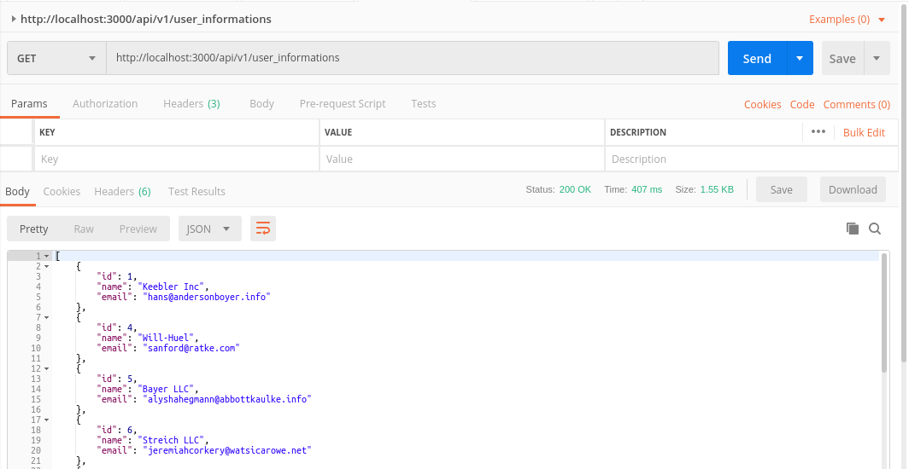
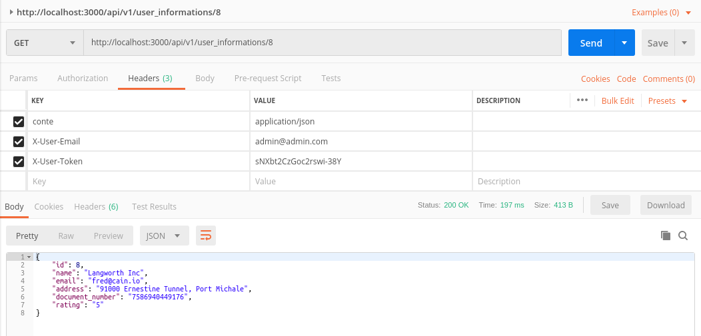
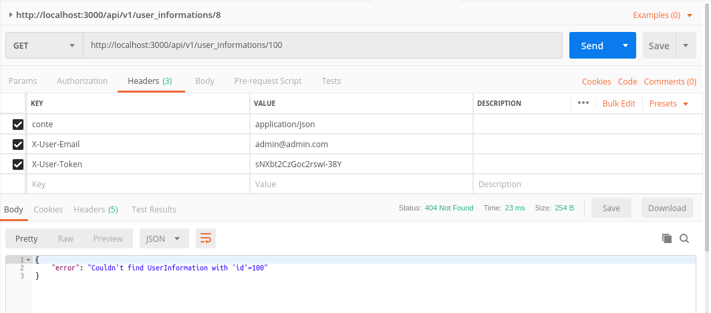
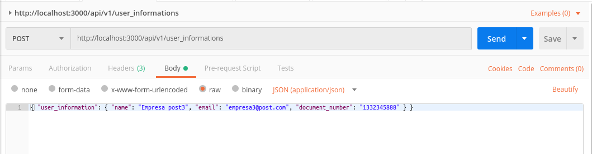
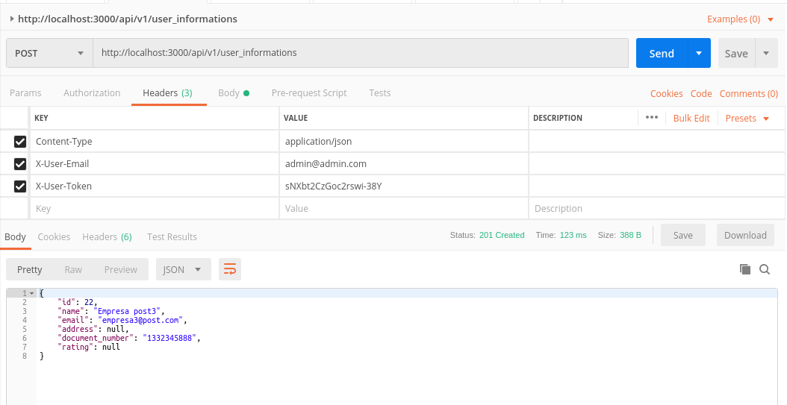

<h1>Rails REST API - User Information</h1>

The purpose of this project is the creation of an API (using the REST architecture) for the management of user information.

<h2>Prerequisites</h2>
This project was built using Rails version 5.2.3 and in the Gemfile it is possible to find all gems that where used. In order to install them, run the command below in the terminal
<pre>
<code>bundle install</code>
</pre>

<h2>The User Information API</h2>

In order to protect more especific information, 

 Request types for user information:

<ul>
  <li><a href="#index">List all (GET)</a></li>
  <li><a href="#show">Show one (GET)</a></li>
  <li><a href="#create">Create (POST)</a></li>
  <li><a href="#edit">Edit (PUT)</a></li>
  <li><a href="#destroy">Delete (DELETE)</a></li>
</ul>

<h3 id="index">Show all instances of UserInformation</h3>

<h3 id="show">Show a specific UserInformation</h3>

<h3 id="create">Create UserInformation</h3>

<h3 id="edit">Edit UserInformation</h3>

<h3 id="destroy">Delete UserInformation</h3>

