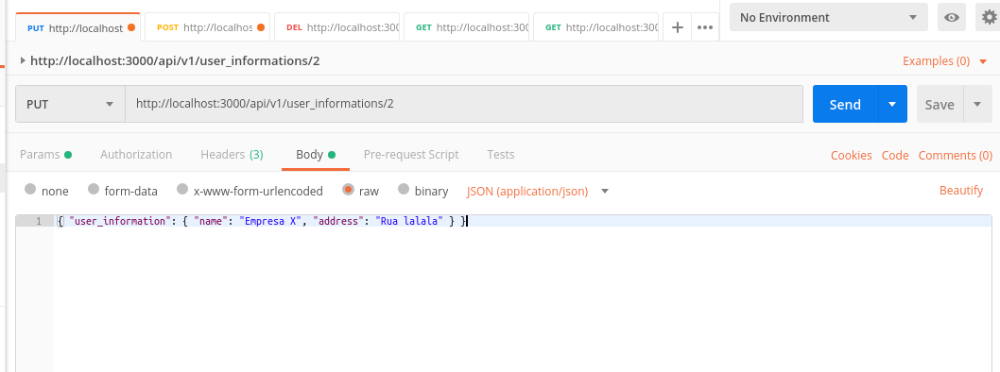

<h1>Rails REST API - User Information</h1>

The purpose of this project is the creation of an API (using the REST architecture) for the management of user information.

<h2>Prerequisites</h2>
This project was built using Rails version 5.2.3 and in the Gemfile it is possible to find all gems that where used. In order to install them, run the command below in the terminal
<pre>
<code>bundle install</code>
</pre>

<h2>The User Information API</h2>

<strong>Except from the GET request in index</strong>, it is required that the user is logged in and use an access token to access the other requests. In these cases, use the following:

<pre>
  <code>
    Content-Type: application/json
    X-User-Email: (insert User email)
    X-User-Token: (insert User authentication token)
  </code>
</pre>

If the user is not logged in, the following message will appear:

<pre>
  <code>
    {
    "error": "You need to sign in or sign up before continuing."
    }
  </code>
</pre>

<h4> Request types for user information:</h4>
<ul>
  <li><a href="#index">Index - List all (GET)</a></li>
  <li><a href="#show">Show one (GET)</a></li>
  <li><a href="#create">Create (POST)</a></li>
  <li><a href="#edit">Edit (PUT)</a></li>
  <li><a href="#destroy">Delete (DELETE)</a></li>
</ul>

<h3 id="index">Show all instances of UserInformation</h3>
<pre>
  <code>GET /api/v1/user_informations</code>
</pre>

<pre>
  <code>Response - Status: 200 OK</code>
</pre>
<pre>
  <code>
    [
        {
            "id": 1,
            "name": "Keebler Inc",
            "email": "hans@andersonboyer.info"
        },
        {
            "id": 4,
            "name": "Will-Huel",
            "email": "sanford@ratke.com"
        },
        {
            "id": 5,
            "name": "Bayer LLC",
            "email": "alyshahegmann@abbottkaulke.info"
        }
    ]
  </code>
</pre>

<h3 id="show">Show a specific UserInformation</h3>
<pre>
  <code>GET /api/v1/user_informations/:id</code>
</pre>

<pre>
  <code>Response - Status: 200 OK</code>
</pre>
<pre>
  <code>
    {
    "id": 1,
    "name": "Keebler Inc",
    "email": "hans@andersonboyer.info",
    "address": "4384 Rigoberto Coves, Carterton",
    "document_number": "5341397077097",
    "rating": "3"
    }
  </code>
</pre>

When record does not exist:

<pre>
  <code>Response - Status: 404 Not Found</code>
</pre>
<pre>
  <code>
    {
      "error": "Couldn't find UserInformation with 'id'=10"
    }
  </code>
</pre>

<h3 id="create">Create UserInformation</h3>
<pre>
  <code>POST /api/v1/user_informations</code>
</pre>

Body
<pre>
  <code>
    { "user_information": { "name": "Empresa post4", "email": "empresa4@post.com", "document_number": "13323458884" } }
  </code>
 </pre>
<pre>
  <code>Response - Status: 201 Created</code>
</pre>
<pre>
  <code>
{
    "id": 23,
    "name": "Empresa post4",
    "email": "empresa4@post.com",
    "address": null,
    "document_number": "13323458884",
    "rating": null
}
  </code>
</pre>

If record already exists
<pre>
  <code>Response - Status: 422 Unprocessable Entity</code>
</pre>
<pre>
  <code>
  {
    "errors": [
        "Name has already been taken",
        "Email has already been taken",
        "Document number has already been taken"
    ]
}
  </code>
</pre>

<h3 id="edit">Edit UserInformation</h3>

<h3 id="destroy">Delete UserInformation</h3>

